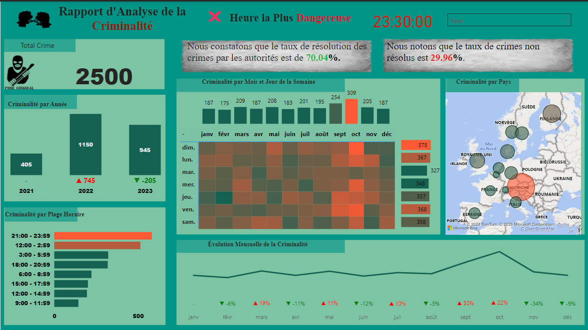
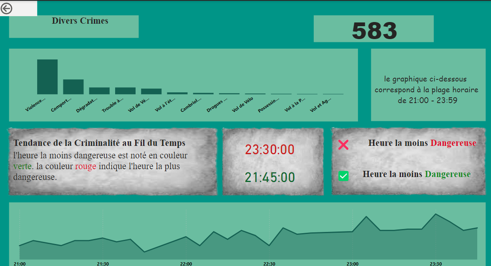
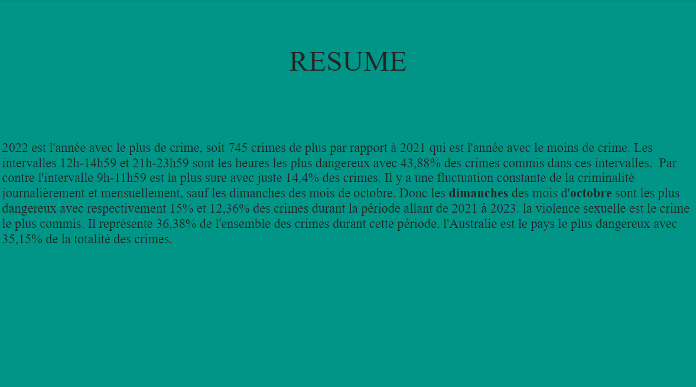

# Crime Analysis Report / Rapport d'Analyse de la Criminalité

The dashboard provides a comprehensive analysis of crime data. The first page highlights key metrics such as the total number of crimes, the most dangerous hour, and crime distribution by year, along with a heatmap of crimes by month and day, a map showing crime by country, monthly crime trends, and crime distribution by time range. The second page delves deeper into crime types, featuring the distribution of various crimes, the total crime count, the most and least dangerous hours, and trends of crimes during specific time ranges.

Le tableau de bord offre une analyse complète des données sur la criminalité. La première page met en avant des indicateurs clés tels que le nombre total de crimes, l'heure la plus dangereuse, la répartition des crimes par année, ainsi qu'une carte thermique des crimes par mois et par jour, une carte montrant les crimes par pays, les tendances mensuelles de la criminalité et la distribution des crimes par plage horaire. La deuxième page explore plus en détail les types de crimes, avec la répartition des divers crimes, le nombre total de crimes, les heures les plus et les moins dangereuses, ainsi que les tendances des crimes durant des plages horaires spécifiques.

*rapport*

*détail*

*résumé*
